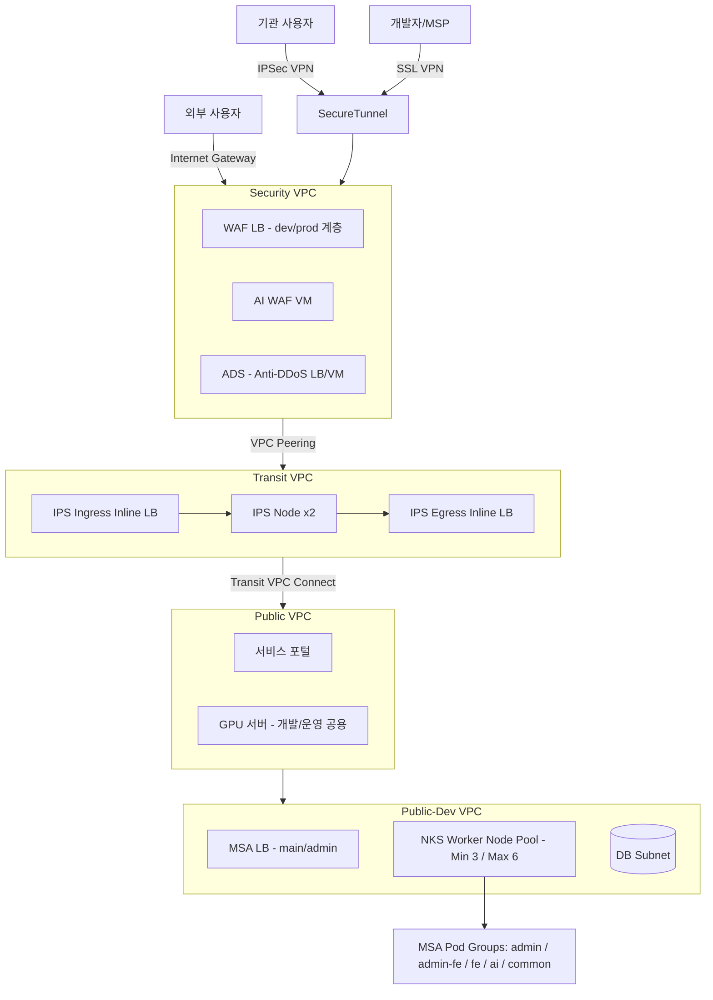

### NCP 기반 공공기관 MSA/Kubernetes 아키텍처

공공기관 클라우드(NCP 공공 리전) 환경에서 MSA 전환 및 Kubernetes 기반 서비스를 구축한 아키텍처입니다. 실제 기관명·프로젝트 코드명·상세 리소스명은 일반화하여 표기하였습니다.

#### 전체 구성도 

#### 트래픽 인입 경로 (특이사항)

기관 내부 사용자, MSP/개발자, 외부 사용자 각각 진입 경로가 다르게 설계되어 있습니다.

- **기관 내부**: IPSec VPN → Secure Tunnel → Security VPC
- **MSP/개발자**: SSL VPN → Secure Tunnel → Security VPC
- **외부 사용자**: Internet Gateway → Security VPC (WAF 선 경유)

세 경로 모두 워크로드 VPC(Public-Dev VPC)에 직접 도달하지 않고, **반드시 Security VPC를 거치도록 강제**되어 있습니다.

#### IPS(침입방지시스템) 경유 후 회귀하는 라우팅 구조 (핵심 특이사항)

이 아키텍처의 가장 눈에 띄는 특징은 **Transit VPC를 트래픽 검사 전용 경유지로 분리**해두었다는 점입니다.

1. Security VPC에서 WAF/AI WAF/ADS를 거친 트래픽이 곧바로 목적지 VPC로 가지 않고, **Transit VPC의 IPS Ingress Inline LB**로 먼저 라우팅됩니다.
2. Transit VPC 내 IPS 노드(이중화 구성)에서 트래픽을 검사합니다.
3. 검사를 마친 트래픽은 **IPS Egress Inline LB를 통해 다시 나가서**, Transit VPC Connect를 거쳐 최종 목적지인 Public/Public-Dev VPC로 전달됩니다.

즉 "Security VPC → Public-Dev VPC" 직선 경로가 아니라, **"Security VPC → Transit VPC(IPS 왕복) → Public VPC → Public-Dev VPC"** 형태로 한 번 우회하는 구조입니다. 이렇게 설계한 이유는 IPS를 인라인(Inline)으로 배치하면서도 특정 VPC에 종속시키지 않고, 여러 워크로드 VPC가 공통으로 재사용할 수 있는 중앙 검사 지점으로 분리하기 위함으로 판단됩니다. VPC 간 연결은 VPC Peering과 Transit VPC Connect를 함께 사용해 구성되어 있습니다.

#### Kubernetes(NKS) 구성 특이사항

- Worker Node Pool을 **Min 3 / Max 6**으로 오토스케일링 구성
- Pod/Service를 **admin / admin-fe / fe / ai / common** 그룹으로 논리적 분리하여 배치 (기능 단위로 네임스페이스 또는 라벨 분리 추정)
- AI 관련 워크로드(admin-api, admin-web, user-api, user-web 등)를 별도 그룹으로 분리해 리소스·스케일링 정책을 독립적으로 관리 가능한 구조

#### GPU 서버 공용 운영

Public VPC 내 GPU 서버를 **개발·운영 환경이 함께 사용**하는 구조로 되어 있어, 별도의 GPU 리소스 이중 구축 없이 공용 리소스로 활용하고 있습니다.

#### 사용 IaC 도구

- **Terraform**: AWS 리소스 프로비저닝 자동화
- **Ansible**: 서버 구성 관리 및 배포 자동화

#### NAS(Network Attached Storage) 범위 분리

민간 리전(NCP)의 CLOVA Studio(Hyper CLOVA X) 접근을 위한 NAS 자원과, 공공 리전 내부용 NAS 자원을 용도별로 분리하여 관리하는 것으로 확인됩니다 (개발/운영 로그 분석용, 개발 전용 등).
