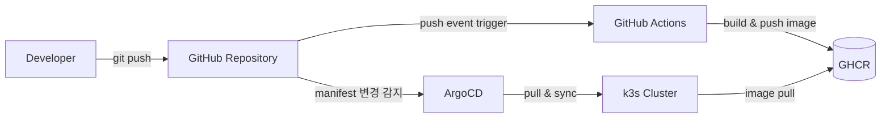
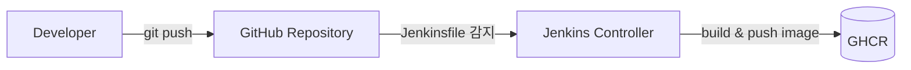

### CI/CD Pipeline: GitOps 기반 배포 파이프라인 검증

### 1. 개요

본 문서는 GitHub Actions(CI) → GitHub Container Registry(GHCR) → ArgoCD(CD) → k3s로 이어지는 Pull 기반 GitOps 파이프라인을 직접 구축하고 검증한 기록이다. 아울러 CI 단계에서 Jenkins를 병행 구성하여, 관리형 CI(GitHub Actions)와 자체 호스팅 CI(Jenkins)의 실제 구성 경험을 비교했다.

핵심 목적은 두 가지다.

1. **Pull 기반 GitOps 구조가 왜 Push 기반 배포보다 보안상 우위에 있는지**를 이론이 아니라 실제 실패·복구 과정을 통해 검증한다.
2. 클라우드 보안/컴플라이언스(CSAP, ISMS-P, PCI-DSS) 실무 경험을 CI/CD 파이프라인 설계에 적용했을 때 어떤 지점을 점검해야 하는지 확인한다.

테스트 환경: NCP 서버(Rocky Linux 9.8, 4vCPU/7.5GB) 위 k3s(단일 노드, control-plane/worker 겸용), 컨테이너 엔진은 Podman.

---
### 2. 아키텍처

두 파이프라인은 의도적으로 분리했다. Jenkins는 CI(빌드/푸시) 역할만 검증했고, 실제 배포(CD)는 GitHub Actions와 연결된 ArgoCD 파이프라인 하나로만 수행했다. Jenkins가 만든 이미지가 k3s에 배포된 적은 없다.

---
### 3. 설계 결정: 왜 Pull 기반 CD(ArgoCD)인가

Push 기반 CD(예: Jenkins/GHA가 파이프라인 내에서 `kubectl apply`를 직접 실행하는 방식)는 CI 도구가 클러스터 접근 자격 증명(kubeconfig)을 보유해야 한다. 이는 CI 도구가 침해당했을 때 클러스터 전체가 노출되는 경로가 된다.

ArgoCD 같은 Pull 기반 GitOps 도구는 클러스터 내부에서 Git 저장소를 주기적으로 폴링하며, 외부로 클러스터 자격 증명을 노출하지 않는다. Git 커밋이 유일한 배포 트리거이자 유일한 진실 공급원(source of truth)이 되므로, 배포 이력이 곧 Git 커밋 이력과 일치해 감사 추적(audit trail) 관점에서도 유리하다.

이 설계 판단은 4번 트러블슈팅 항목(Auto-sync 환경에서의 롤백 제약)에서 실제로 검증되었다.

---
### 4. 구현 및 검증 절차

| Phase | 내용 | 결과 |
|---|---|---|
| 0 | k3s 설치, 사전 환경 점검(firewalld/SELinux) | 완료 |
| 1 | GitHub Actions로 Dockerfile 빌드 → GHCR push | 완료 |
| 2 | k3s에서 GHCR private 이미지 pull 검증 (imagePullSecrets) | 완료 |
| 3 | ArgoCD 설치 및 Application 등록, 자동 동기화 구성 | 완료 |
| 4 | 이미지 버전 변경 시 자동 배포 및 롤백 시나리오 검증 | 완료 |

---
### 5. 트러블슈팅 기록

실제 구성 과정에서 발생한 문제와 원인, 해결을 기록한다. 재현 가능한 명령/에러만 남겼다.

| # | 증상 | 원인 | 해결 |
|---|---|---|---|
| 1 | Fine-grained PAT로 GHCR push 시도 시 Account 권한 목록에 Packages 항목 자체가 없음 | Fine-grained token은 GHCR(Packages) 권한 자체를 지원하지 않음 | Classic PAT(`write:packages`, `read:packages`)로 전환 |
| 2 | `git push` 시 `refusing to allow a Personal Access Token to create or update workflow` 에러 | `.github/workflows/` 파일 변경에는 별도 `workflow` scope 필요 | PAT scope에 `workflow` 추가 |
| 3 | k3s 배포 시 `401 Unauthorized` → `ImagePullBackOff` | Private GHCR 이미지 pull에 클러스터 인증 정보(imagePullSecrets) 미설정 | `kubectl create secret docker-registry`로 GHCR 인증 secret 생성 후 Deployment에 연결. push 인증(repo secret)과 pull 인증(k8s secret)은 별개 경로임을 확인 |
| 4 | 존재하지 않는 이미지 태그로 배포 시 `argocd app rollback` 실행이 `FailedPrecondition`으로 거부됨 | Auto-sync 활성화 상태에서는 수동 rollback이 Git 상태와 충돌하므로 ArgoCD가 이를 차단 | `git revert`로 Git 상태 자체를 되돌리고 ArgoCD가 이를 재동기화하도록 유도. Kubernetes Deployment의 rolling update 특성상 신규 파드 pull 실패 중에도 기존 파드는 유지되어 서비스 다운타임은 발생하지 않음을 확인 |
| 5 | Jenkins 컨테이너 내 `docker build` 실행 시 `docker: not found` | Jenkins 공식 이미지에는 Docker CLI가 포함되어 있지 않음 | 컨테이너 내부에 Docker CLI 설치. (프로덕션에서는 CLI가 사전 포함된 전용 agent 이미지 구성이 적절함) |
| 6 | Docker CLI 설치 후 `permission denied ... docker.sock` | 컨테이너 실행 사용자(jenkins)가 마운트된 Podman 소켓 접근 권한 없음 | `chmod 666`으로 임시 완화. 이는 최소 권한 원칙에 반하므로, 프로덕션에서는 그룹 기반 권한 부여가 필요함을 확인 |
| 7 | `docker push` 시 `image not known` (build는 성공 로그 출력됨) | 최신 Docker CLI는 기본적으로 BuildKit을 사용하며, `--load` 옵션 없이는 빌드 결과가 로컬 이미지 목록에 반영되지 않음 | `docker buildx build --load` 로 명시적 로드 |
| 8 | Jenkins agent 분리 구성(`docker:24-dind`, `docker:24-cli`) 시 `process apparently never started` | Alpine 기반 이미지가 Jenkins의 durable task(비대화형 스크립트 실행) 방식과 호환되지 않음. entrypoint 오버라이드로도 재현됨을 확인 | 원인을 Alpine 베이스 이미지의 셸 실행 방식 차이로 특정. Controller 내부 직접 실행(DooD) 구성이 현재 환경에서 더 안정적인 방식임을 확인하고 이를 기준선으로 채택 |

---
### 6. CI 도구 비교: GitHub Actions vs Jenkins

| 항목 | GitHub Actions | Jenkins |
|---|---|---|
| 운영 방식 | GitHub 관리형, 별도 인프라 불필요 | 자체 호스팅, 서버/컨테이너 직접 관리 필요 |
| 설정 언어 | YAML | Groovy 기반 Declarative/Scripted Pipeline |
| GHCR 인증 | `github.actor` + `secrets.GITHUB_TOKEN` 조합으로 기본 통합 | 별도 Credentials 등록 및 관리 필요 |
| 초기 학습 곡선 | 낮음 (정형화된 YAML 구조) | 상대적으로 높음 (플러그인 생태계, Groovy 문법) |
| 컨테이너 빌드 환경 | 관리형 러너에 Docker 사전 포함 | 별도 구성 필요 (본 검증에서 다수의 환경 이슈 발생) |
| 적합 환경 | GitHub 기반 팀, 클라우드 네이티브 워크플로우 | 온프레미스/에어갭 환경, 세밀한 커스터마이징이 필요한 대규모 조직 |

본 검증에서 GitHub Actions는 별도 환경 구성 없이 곧바로 파이프라인이 동작한 반면, Jenkins는 컨테이너 런타임 호환성(Docker CLI 부재, 소켓 권한, BuildKit 동작 방식) 문제를 다수 해결해야 했다. 이는 Jenkins 자체의 결함이 아니라, "CI 실행 환경을 어디까지 직접 구성/운영해야 하는가"라는 관리형 서비스와 자체 호스팅 도구 간의 근본적인 차이를 보여준다.

---
### 7. 보안/컴플라이언스 관점 점검 사항

- **초기 자격 증명 교체**: ArgoCD, Jenkins 모두 설치 시 임의 생성된 초기 admin 비밀번호를 사용한다. CSAP/ISMS-P의 기본 계정·비밀번호 관리 통제 항목과 직결되는 지점이며, 프로덕션 환경에서는 최초 로그인 직후 즉시 교체가 필요하다.
- **PAT 권한 최소화**: Classic PAT는 repo 단위 권한 제한이 불가능해 계정 전체 패키지에 접근 가능하다. 유출 시 영향 범위가 넓으므로 만료 기간을 짧게 설정하고, 사용 종료 즉시 폐기하는 것이 적절하다.
- **DooD(Docker-outside-of-Docker) 구성의 한계**: 호스트 소켓을 컨테이너에 마운트하는 방식은 해당 컨테이너가 침해될 경우 호스트 수준 권한 획득으로 이어질 수 있는 구조다. 본 검증에서는 테스트 목적으로 사용했으나, 프로덕션에서는 Kaniko와 같은 daemonless 빌드 도구 또는 격리된 전용 빌드 agent 구성이 필요하다.
- **TLS 검증**: ArgoCD 접근 시 self-signed 인증서로 인해 `--insecure` 옵션을 사용했다. 프로덕션 환경에서는 신뢰할 수 있는 인증서 발급이 필요하다.

---
### 8. 범위와 한계

- 단일 노드 k3s 테스트 클러스터 기준으로 검증했으며, 멀티 노드/프로덕션 규모의 부하·장애 시나리오는 다루지 않았다.
- Deployment에 readiness/liveness probe를 설정하지 않았다. 본 검증에서 재현한 `ImagePullBackOff` 시나리오는 Kubernetes의 rolling update 기본 동작으로 방어되었으나, 애플리케이션 자체가 비정상 기동되는 경우(헬스체크 부재 시 발생 가능한 장애)는 검증 범위에 포함되지 않는다.
- Jenkins는 CI(빌드/푸시) 단계까지만 검증했으며, CD와는 통합하지 않았다.
- Jenkins의 컨테이너 빌드 환경은 Controller 내부 직접 실행(DooD) 방식으로 구성했다. Alpine 기반 이미지를 사용하는 agent 분리 구성을 시도한 결과 durable task 실행 방식과의 호환성 문제를 확인했으며, 이를 근거로 DooD 방식을 최종 구성으로 채택했다.
