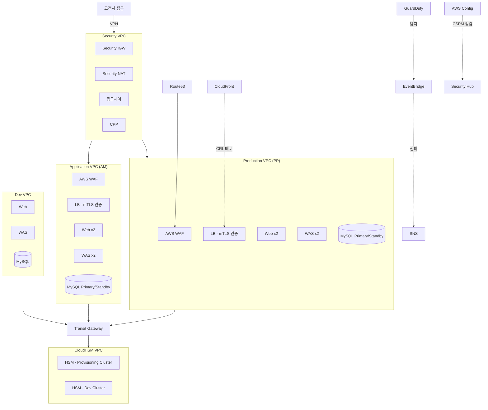

### PCI-DSS 대응 AWS 인프라 아키텍처
PCI-DSS 12개 요구사항에 대응하기 위해 구성한 AWS 인프라 아키텍처입니다. 

### 전체 구성도

### 계층별 구성 원칙
- **Public Subnet**: NAT Gateway, ALB/WAF만 배치. 인터넷 인바운드는 WAF를 반드시 경유
- **Private Subnet (Web/WAS)**: 인터넷 직접 노출 없음, ALB를 통해서만 트래픽 유입
- **Private Subnet (DB)**: Primary/Standby 이중화 구성, WAS 계층에서만 접근 가능
- **Security VPC**: 접근제어(CPP) 및 감사 관련 리소스를 별도 VPC로 분리, Transit Gateway로 각 VPC와 연결
- **CloudHSM VPC**: 키 관리 전용 VPC로 분리, Transit Gateway를 통해서만 도달 가능 (직접 라우팅 없음)

### PCI-DSS 요구사항 맵핑
| 구성 요소 | 대응 PCI-DSS 요구사항 | 비고 |
|---|---|---|
| AWS WAF | Req 6 (애플리케이션 보안) | Public Subnet 진입점에 배치, 예외 처리는 별도 포털로 관리 |
| LB mTLS 인증 | Req 4 (전송 구간 암호화), Req 8 (인증) | ACM Private CA 기반 클라이언트 인증서, ECDSA P256 |
| GuardDuty → EventBridge → SNS | Req 10 (로깅 및 모니터링), Req 11 (침입 탐지) | 실시간 이벤트 전파 파이프라인 |
| AWS Config + Security Hub (CSPM) | Req 2 (기본 구성 관리), Req 11 (취약점 관리) | CIS Benchmark 기준 상시 점검 |
| Client VPN (Security VPC 경유) | Req 1 (네트워크 분리), Req 7 (접근 제한) | 외부 접근은 Security VPC를 통해서만 허용, 운영 VPC 직접 접근 차단 |
| CloudHSM ↔ KMS | Req 3 (저장 데이터 암호화) | CloudHSM을 KMS의 Custom Key Store로 연동, 키 생성·저장을 HSM 하드웨어 경계 내에서 수행 |

### CloudHSM (⇄KMS)
- KMS는 기본적으로 AWS 관리형 소프트웨어 기반 키 스토어를 사용하지만, PCI-DSS 등 규제 준수를 위해 KMS Custom Key Store를 CloudHSM 클러스터에 연결하는 구조로 구성
- CloudHSM은 FIPS 140-2 Level 3 인증 하드웨어 기반으로, 키 자체가 HSM 경계를 벗어나지 않음 (KMS는 API 호출만 중계)
- CloudHSM 클러스터는 Provisioning/Dev 등 용도별로 분리하여 운영 환경과 개발 환경의 키 관리 경계를 분리
- CloudHSM VPC는 Transit Gateway를 통해서만 연결되며, 각 VPC에서 직접 라우팅되지 않도록 구성 (키 관리 영역의 네트워크 격리)

### 네트워크 분리
- Production / Application / Dev 환경을 VPC 단위로 완전히 분리 (Req 1 네트워크 분리 요구사항 대응)
- 각 VPC의 DB Subnet은 Primary/Standby 이중화 구성이나, Dev VPC는 이중화 없이 단일 인스턴스로 운영 (운영 환경과 개발 환경의 가용성 요구 수준 차등 적용)
- 모든 VPC 간 통신은 Transit Gateway를 경유하며, VPC Peering을 통한 직접 연결은 사용하지 않음
