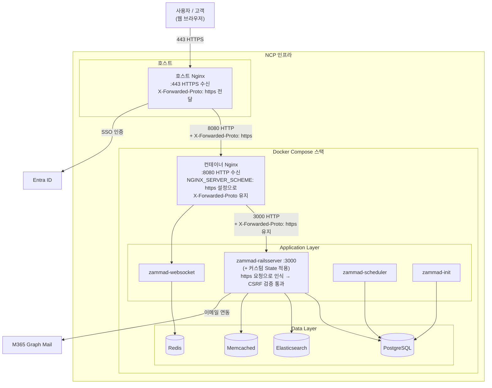
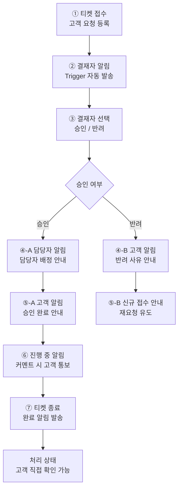

### tooling/
내부 운영 도구 검토·설계·구축 기록

이 폴더는 두 가지 프로젝트를 포함한다.
1. 내부 보안 헬프데스크 시스템 (Zammad) — 검토·설계·배포 및 SaaS(M365, Entra ID) 협업
2. CSAP 증적자료 체크리스트 RAG 어시스턴트 — Bedrock 기반 임베딩 검색 + 생성형 Q&A

---

## 1. 내부 보안 헬프데스크 시스템 (Zammad)

### 1.1 개요
보안팀 요청/이슈 관리 프로세스를 체계화하기 위해 내부 헬프데스크 시스템 도입을 검토·구축

### 1.2 도구 선정
두 도구 모두 Entra ID SSO 연동은 가능했으나, Zammad는 Core Workflows를 통한 세밀한 승인 트리거 자동화 구현이 가능했고 M365 Graph Mail 연동도 원활했으나, OS-Ticket은 PHP 기반 아키텍처의 보안 이슈가 확인되어 보안 헬프데스크 용도로는 적합하지 않다고 판단

| 항목 | Zammad | OS-Ticket |
|---|---|---|
| 자동화 | Core Workflows 기반 트리거 자동화 구현 (승인 프로세스 등) | 기본 라우팅/배정 |
| 확장성 | Entra ID SSO, M365 Graph Mail 연동 검증 완료 | Entra ID 연동 자체는 가능하나, 자동화 확장성에서 Zammad 대비 제한적 |
| 취약점 | - | 레거시 PHP 아키텍처 기반. 검토 시점에 PDF 생성 라이브러리 관련 파일 읽기 취약점(CVE-2026-22200) 등 보안 이슈 확인, 채택 리스크 판단에 반영 |

### 1.3 아키텍처
- NCP 인프라 위에 Docker Compose 기반 컨테이너 스택으로 구성
- 리버스 프록시 이중 구조 (호스트 Nginx → 컨테이너 Nginx)
```
브라우저
  ↓ (443 HTTPS)
호스트 Nginx → X-Forwarded-Proto: https 전달
  ↓ (8080 HTTP)
컨테이너 Nginx → NGINX_SERVER_SCHEME: https 덕분에 
                  X-Forwarded-Proto: https 유지하며 전달
  ↓ (3000 HTTP)
Rails (Zammad) → 원요청 https로 인식
                  → callback URL을 https://로 생성
                  → CSRF 검증 통과
```



### 1.4 통합 구성
- M365 Graph Mail: 이메일 기반 티켓 생성/연동
- Entra ID SSO: 사용자 인증 통합 --> 임시 신규 사용자 생성도 가능
- Core Workflows: 승인 트리거 구성

### 1.4.1 티켓 처리 플로우 설계
승인 기반 티켓 처리 프로세스를 Core Workflows 트리거로 설계 및 구성

- 흐름(요약): 티켓 접수 → 결재자 알림 → (승인/반려) 담당자·고객 알림 → (진행중) 고객 알림 → (종료) 고객 알림

- 흐름(상세):
1. 티켓 접수 — 고객 요청 등록
2. 결재자 알림 — Trigger 자동 발송
3. 결재자 승인/반려 선택
4. 승인 시: 담당자 배정 알림 + 고객 승인 완료 알림 → 진행중 상태로 전환, 커멘트 발생 시 고객 통보
5. 반려 시: 고객에게 반려 사유 안내 → 신규 접수 안내(재요청 유도)
6. 티켓 종료 — 완료 알림 발송, 고객은 처리 상태를 직접 확인 가능

이 흐름을 통해 결재-담당자 배정-고객 커뮤니케이션이 자동화되어, 수동으로 상태를 안내하던 기존 프로세스 대비 응대 누락을 줄일 수 있도록 구성



### 1.4.2 커스텀 State 추가 (Rails 서버 직접 적용)
솔루션 자체 UI/설정 옵션만으로는 "진행중(In progress)"상태를 세분화할 수 없어, Rails 서버에 직접 커스텀 State를 추가
```ruby
# 커스텀 State 추가
docker exec zammad-docker-compose-zammad-railsserver-1 \
  /opt/zammad/bin/rails r "
    state = Ticket::State.new(
      name: 'In progress',
      state_type: Ticket::StateType.find_by(name: 'open'),
      updated_by_id: 1,
      created_by_id: 1
    )
    state.save!
    puts 'In progress 생성 완료'
  "
```
Zammad UI 설정 범위를 벗어난 서버 레벨 직접 수정이므로, 향후 Zammad 버전 업데이트나 설정 변경 시 호환성 문제가 발생할 수 있음. 업데이트 전 커스텀 State 적용 여부를 반드시 확인하고, 변경 이력을 별도로 관리해 지속적으로 모니터링할 필요가 있음.

### 1.5 트러블슈팅

#### CSRF / 422 오류
- 증상: Entra ID SSO 연동 중 CSRF 토큰 검증 실패로 422 오류 발생
- 원인: 리버스 프록시 환경에서 서버 스킴 설정 누락
- 해결: `NGINX_SERVER_SCHEME: https` 환경변수 설정으로 해결

---

## 2. CSAP 증적자료 체크리스트 RAG 어시스턴트

### 2.1 개요
CSAP 인증 사후평가 증적자료 체크리스트를 기반으로, 통제항목에 대해 질의하면 관련 항목을 검색(Retrieval)하여 그 내용만 근거로 답변을 생성(Generation)하는 RAG 파이프라인. CSAP 사후평가 대응 중 체크리스트 항목이 많아 필요 증적을 빠르게 조회하기 위한 목적으로 구축.

### 2.2 아키텍처
```
│ 엑셀 파싱 (병합 셀 forward-fill)
▼
checklist.json (범주/분야/통제항목/필요증적/비고 구조화)
│ Bedrock Titan Text Embeddings V2
▼
embeddings.npy + checklist_with_text.json (로컬 벡터 인덱스)
│
│ 질문 입력
▼
질문 임베딩 → 코사인 유사도 Top-K 검색 → Nova Lite에 컨텍스트로 전달 → 답변 생성
```

### 2.3 설계 결정
- **벡터DB 대신 numpy 배열**: 체크리스트 항목이 ~50개 수준이라 OpenSearch 같은 실제 벡터 인덱스는 오버스펙으로 판단. 항목 수 확대 시 OpenSearch Serverless(Bedrock Knowledge Base 연동) 전환을 다음 단계로 계획
- **생성 모델은 Nova Lite**: 별도 GuardDuty AI Triage 프로젝트에서 Claude Haiku 모델 접근 오류로 Nova로 전환했던 트러블슈팅 경험을 재사용
- **환각 방지**: 프롬프트에서 "참고 항목에 없으면 모른다고 답하라"고 명시해 체크리스트에 없는 내용을 지어내지 않도록 제한

### 2.4 사용 모델
- 임베딩: `amazon.titan-embed-text-v2:0`
- 생성: `amazon.nova-lite-v1:0`
- 리전: ap-northeast-2 (서울)

### 2.5 향후 확장
- 체크리스트 외 실제 증적 문서(정책서, 결과보고서)까지 색인 범위 확대
- 여러 인증 기준(CSAP, ISMS-P, PCI-DSS) 통합 검색
- 항목 수 증가 시 OpenSearch Serverless 기반 Bedrock Knowledge Base로 전환