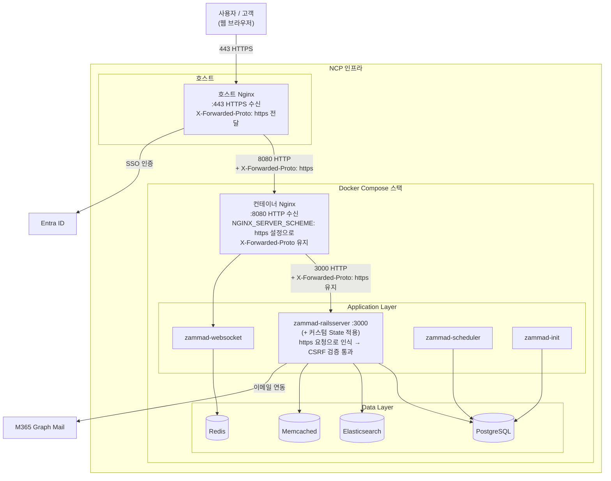
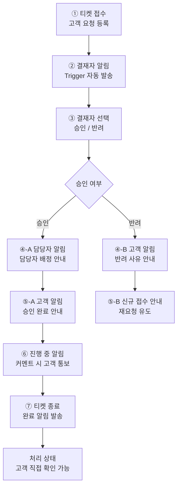

#### tooling/
내부 보안 헬프데스크 시스템 검토 (구축 및 운영)

#### 1. 개요
· 보안팀 요청/이슈 관리 프로세스를 체계화하기 위해 내부 헬프데스크 시스템 도입을 검토·구축
· 대상 도구는 Zammad와 OS-Ticket이며, 검토 결과 Zammad를 최종 선정해 NCP 인프라에 Docker Compose 기반으로 배포

#### 2. 도구 선정: Zammad vs OS-Ticket
| 항목 | Zammad | OS-Ticket |
|---|---|---|
| UI/UX | 실무 담당자 접근성 고려시 최적 | - |
| 자동화 | Core Workflows 기반 트리거 자동화 구현 (승인 프로세스 등) | 기본 라우팅/배정 |
| 인증 연동 | Entra ID SSO, M365 Graph Mail 연동 검증 완료 | Entra ID 연동 자체는 가능하나, 자동화 확장성에서 Zammad 대비 제한적 |
| 보안 리스크 | - | 레거시 PHP 아키텍처 기반. 검토 시점에 PDF 생성 라이브러리 관련 파일 읽기 취약점(CVE-2026-22200) 등 보안 이슈 확인, 채택 리스크 판단에 반영 |

**선정 사유 요약**: 두 도구 모두 Entra ID SSO 연동은 가능했으나, Zammad는 Core Workflows를 통한 세밀한 승인 트리거 자동화 구현이 가능했고 M365 Graph Mail 연동도 원활했다. 반면 OS-Ticket은 레거시 PHP 기반 아키텍처의 알려진 보안 이슈가 확인되어, 보안 헬프데스크 용도로는 적합하지 않다고 판단

#### 3. 아키텍처
- NCP 인프라 위에 Docker Compose 기반 컨테이너 스택으로 구성
- 리버스 프록시 이중 구조 (호스트 Nginx → 컨테이너 Nginx)

```
브라우저
  ↓ (443 HTTPS)
호스트 Nginx → X-Forwarded-Proto: https 전달
  ↓ (8080 HTTP)
컨테이너 Nginx → NGINX_SERVER_SCHEME: https 덕분에 
                  X-Forwarded-Proto: https 유지하며 전달
  ↓ (3000 HTTP)
Rails (Zammad) → 원요청 https로 인식
                  → callback URL을 https://로 생성
                  → CSRF 검증 통과
```



#### 4. 통합 구성
- **M365 Graph Mail**: 이메일 기반 티켓 생성/연동
- **Entra ID SSO**: 사용자 인증 통합
- **Core Workflows**: 커스텀 승인 트리거 구성

#### 4.1 티켓 처리 플로우 설계
승인 기반 티켓 처리 프로세스를 Core Workflows 트리거로 설계 및 구성

**흐름(요약)**: 티켓 접수 → 결재자 알림 → (승인/반려) 담당자·고객 알림 → (진행중) 고객 알림 → (종료) 고객 알림

**흐름(상세)**:
1. 티켓 접수 — 고객 요청 등록
2. 결재자 알림 — Trigger 자동 발송
3. 결재자 승인/반려 선택
4. **승인 시**: 담당자 배정 알림 + 고객 승인 완료 알림 → 진행중 상태로 전환, 커멘트 발생 시 고객 통보
5. **반려 시**: 고객에게 반려 사유 안내 → 신규 접수 안내(재요청 유도)
6. 티켓 종료 — 완료 알림 발송, 고객은 처리 상태를 직접 확인 가능

이 흐름을 통해 결재-담당자 배정-고객 커뮤니케이션이 자동화되어, 수동으로 상태를 안내하던 기존 프로세스 대비 응대 누락을 줄일 수 있도록 구성



#### 4.2 커스텀 State 추가 (Rails 서버 직접 적용)
Zammad 솔루션 자체 UI/설정 옵션만으로는 "진행중(In progress)" 상태를 세분화할 수 없어, Rails 서버에 직접 커스텀 State를 추가

```ruby
# 커스텀 State 추가
state = Ticket::State.new(
  name: 'In progress',
  state_type: Ticket::StateType.find_by(name: 'open'),
  updated_by_id: 1,
  created_by_id: 1
)
state.save!
```

**주의사항**: Zammad UI 설정 범위를 벗어난 서버 레벨 직접 수정이므로, 향후 Zammad 버전 업데이트나 설정 변경 시 호환성 문제가 발생할 수 있음. 업데이트 전 커스텀 State 적용 여부를 반드시 확인하고, 변경 이력을 별도로 관리해 지속적으로 모니터링할 필요가 있다.

#### 5. 트러블슈팅

#### 5.1 CSRF / 422 오류
- **증상**: Entra ID SSO 연동 중 CSRF 토큰 검증 실패로 422 오류 발생
- **원인**: 리버스 프록시 환경에서 서버 스킴 설정 누락
- **해결**: `NGINX_SERVER_SCHEME: https` 환경변수 설정으로 해결
---
※ 모든 항목은 실제 업무 기반이며, 고객사명 등 기밀 정보는 일반화하여 기술하였습니다.
